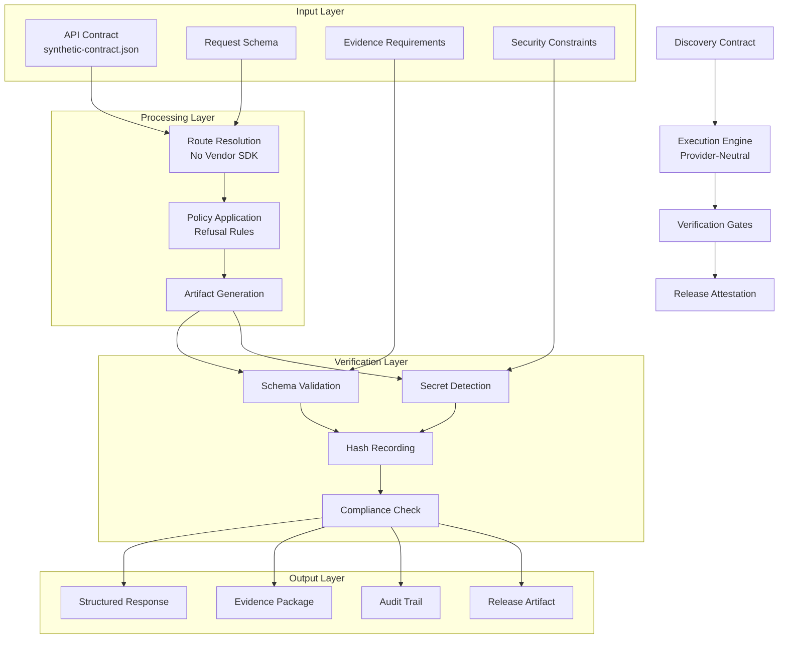
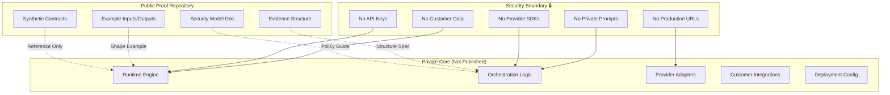
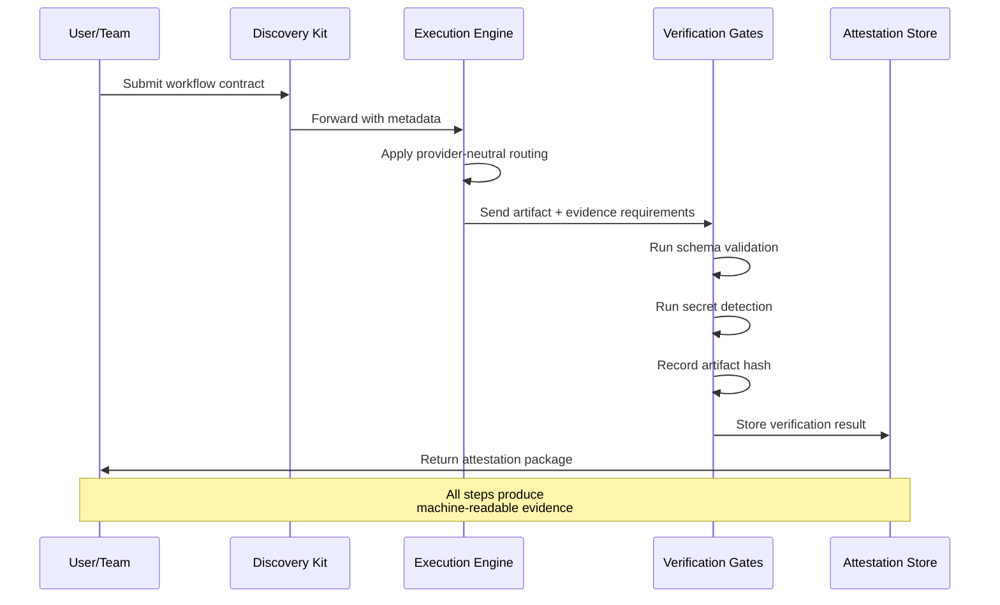
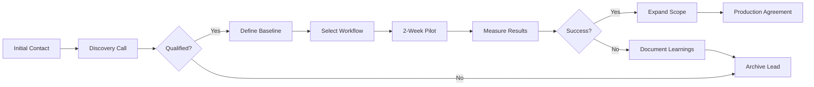

# System Architecture Diagram

## High-Level Workflow



## Security Boundary Model



## Evidence Flow



## Pilot Engagement Flow



## Component Responsibilities

| Component | Responsibility | Public Evidence | Private Implementation |
|-----------|---------------|-----------------|----------------------|
| **Discovery Contract** | Define workflow scope, inputs, outputs, constraints | ✅ `synthetic-contract.json` | ❌ Customer-specific templates |
| **Execution Engine** | Route requests without vendor lock-in | ✅ Provider-neutral design doc | ❌ Runtime orchestration code |
| **Verification Gates** | Validate schema, detect secrets, record hashes | ✅ Evidence structure spec | ❌ Validation implementation |
| **Attestation Store** | Store and retrieve verification results | ✅ Sample output format | ❌ Storage backend, APIs |
| **Security Model** | Define refusal rules and boundaries | ✅ `security-model.md` | ❌ Enforcement mechanisms |

## Data Classification Model

```
┌─────────────────────────────────────────────────────────────┐
│                    DATA CLASSIFICATION                       │
├──────────────┬──────────────┬──────────────┬────────────────┤
│   PUBLIC     │   SYNTHETIC  │   INTERNAL   │   CONFIDENTIAL │
├──────────────┼──────────────┼──────────────┼────────────────┤
│ README.md    │ Contracts    │ Runtime      │ Customer Data  │
│ Security Doc │ Demo IDs     │ Prompts      │ API Keys       │
│ Examples     │ Fake Payloads│ Config       │ Production URLs│
│ License      │ Test Outputs │ Integrations │ Credentials    │
└──────────────┴──────────────┴──────────────┴────────────────┘
         │              │              │              │
         ▼              ▼              ▼              ▼
    GitHub Public   This Repo     Private Repo    Never Stored
```

---

*This diagram is for understanding the system architecture. Actual implementation details are in the private core repository.*
